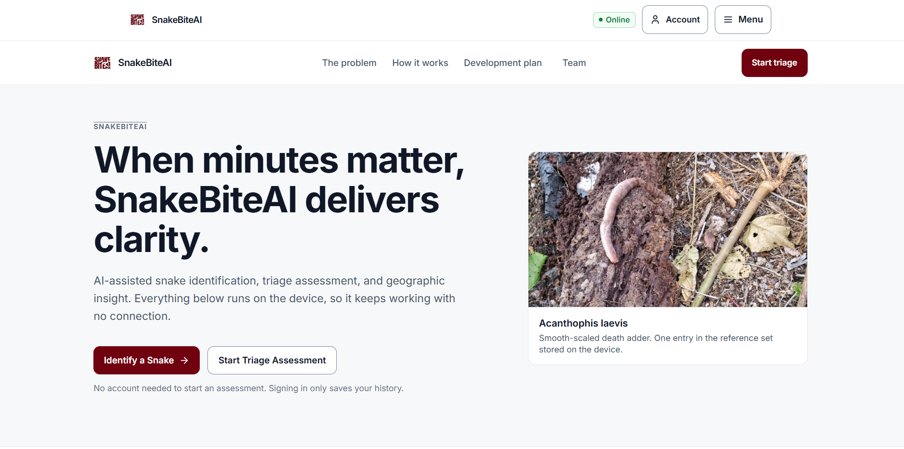

# SnakeBiteAI

**When minutes matter, SnakeBiteAI delivers clarity.**

An offline-first progressive web app for snakebite response: AI-assisted identification, a triage assessment that runs without an account, and a geographic view for surveillance. Built for low-resource Android phones in areas where the connection is unreliable and the nearest clinic is a long drive away.

Built by the **Kenapa Mendadak Banget Sih** team for **HSIL Hackathon 2026, Bandung Hub**, with support and reference from Harvard T.H. Chan School of Public Health (Health Systems Innovation Lab), AI for Smart-X, PATH Global Health, and Universitas Diponegoro.



---

## What it does

**Identification without a network.** Photograph a snake or pick one from the on-device reference set. The pipeline runs locally and returns a ranked list with a confidence figure, never a certainty. The page states plainly that this is a suggestion, not a diagnosis, and lists the visual features the model matched so a user can disagree with it.

**Triage without an account.** Four short questions about the bite produce a grade from 0 to 4, the reasoning behind it, and the handling steps to follow. Tourniquets are banned on the result screen in every case. The full result is on screen before any account prompt appears.

**One account, three ways in.** The landing page navigation offers only Sign in and Register; the app navigation appears once you are signed in. Both account pages carry a secondary control for a government account, which opens the surveillance view. An assessment finished while signed out can be handed to the register page, which writes it to your history the moment the account exists.

**Geographic discovery.** Species recorded for your region, with a species page that discloses identification, distribution, habitat, and venom detail in sections rather than as a wall of text.

**A surveillance view.** Regional distribution on a map, per-species report counts, and a sync queue, all computed from records held on the device.

---

## Quick start

Requires Node.js 18 or newer.

```bash
npm install
npm run dev          # http://localhost:5174
npm test             # 57 tests across 6 files
npm run build        # production build into dist/
npm run preview      # serve the built app
```

---

## Architecture
| Layer | Choice | Role |
|---|---|---|
| View | React 18 + TypeScript + Tailwind CSS 4 | Components and responsive layout |
| Routing | React Router 6 | Real URLs, so a refresh on `/triage` lands on the assessment |
| ViewModel | Zustand | GPS, network status, account and role, held assessment, sync queue |
| Model | Dexie.js over IndexedDB | Species reference set and encrypted incident records |
| Services | Web Crypto API | AES-256-GCM encryption at rest, PBKDF2 key derivation |
| Offline | Service worker | Shell, hashed bundle, and reference images cached on first visit |

Routing brings one deployment requirement: unknown paths must serve the shell.
`vite.config.ts` sets `appType: "spa"` so `vite preview` does the fallback, and
`default.conf` already had `try_files $uri $uri/ /index.html` for the nginx
container. A server without either will 404 on a refreshed deep link.

Clinical rules live in `src/lib/clinical.ts` and are covered by unit tests: the
grading ladder, the recheck intervals, and the tourniquet ban. The assessment
draft that crosses the register page is built in `src/lib/assessment.ts`.

### Navigation model

| Route | Reachability |
|---|---|
| `/` | Always. Carries its own navigation, no shell header |
| `/login`, `/register` | Always |
| `/triage` | Always, from the hero |
| `/identify`, `/discover`, `/species/:id` | Always, by URL and from the post-assessment options |
| `/activity`, `/history`, `/account` | Signed in |
| `/government` | Government account |

The app navigation bar shows only for a signed-in general user. The pages behind
it stay reachable by URL while signed out, because the assessment result offers
the snake map and the camera as next steps.
---

## Design system

Tokens are defined once in `src/index.css` and mirrored into `tailwind.config.js`. The source of truth is `DESIGN.md`.

| Role | Value |
|---|---|
| Brand accent | `#70020F` |
| Canvas | `#F7F8FA` |
| Surface | `#FFFFFF` |
| Text primary / secondary / muted | `#101828` / `#475467` / `#667085` |
| Success / warning / danger / info | `#15803D` / `#B7791F` / `#C53030` / `#2563EB` |

Three tokens deviate from the literal hexes in `DESIGN.md`, because the values given there fail the WCAG AA standard the same document requires. Each deviation is commented in the token file:

- `--color-warning-ink: #92400e` carries warning text. `#B7791F` on its own background measures 3.51:1 and fails for normal text; `#92400e` measures 6.84:1.
- `--color-control-border: #7a8699` on inputs and buttons. `#D0D5DD` measures 1.47:1 against white and fails the 3:1 non-text bar.
- `--color-text-disabled: #98a2b3` is graphic-only and never used for text. It measures 2.58:1 at every size.

Accessibility is verified rather than asserted: 44 px minimum targets, a visible 2 px focus ring on every interactive element, semantic landmarks, and status conveyed by an explicit word rather than colour alone.

---

## Verification

Three harnesses drive the built app in headless Chrome over CDP. Start `npm run preview` first; the preview port is printed on startup.

```bash
node tools/click-through.mjs http://localhost:4174 390   # per-viewport click-through
node tools/contrast-audit.mjs  http://localhost:4174      # computed contrast across 4 screens
node tools/offline-check.mjs   http://localhost:4174      # reload with the network blocked
```

`click-through.mjs` takes a width and a height, so it can be run at each breakpoint. Current results: 65 assertions passing at 360, 390, 768, 1024, 1280 and 1440 px with zero console errors, 222 text nodes passing AA, and the full triage and identification flows completing with the network disabled. Deep links resolve both online and offline.

---

## Known limits

- The map outlines are schematic island-group shapes, not administrative province boundaries. Real province polygons need a GeoJSON source that is not in this repository.
- Government figures describe records collected on that device. With an empty store every number is a true zero, and the interface says so. There is no live ministry feed yet.
- Identification scores are deterministic rather than model output. The reference set holds four species.
- Wound photographs are held as base64 inside the encrypted incident record, which is fine at prototype scale and would not be for a real record.

---

## Team

- **Haidar Ali Laudza** (Informatics) — project lead, AI engineering
- **Julius Tegar Aji Putra** (Informatics) — AI engineering, mobile application
- **Muhammad Fikri** (Informatics) — backend, systems integration
- **Cahya Mutiara Sandi** (Nursing) — clinical advisor, domain expert
- **Elizabet Febriani** (Nursing) — clinical advisor, domain expert

Organisations are named as part of the team's support and reference network. Listing them is not a statement of formal partnership or endorsement.

---

## License

Research prototype. Not cleared for clinical use.